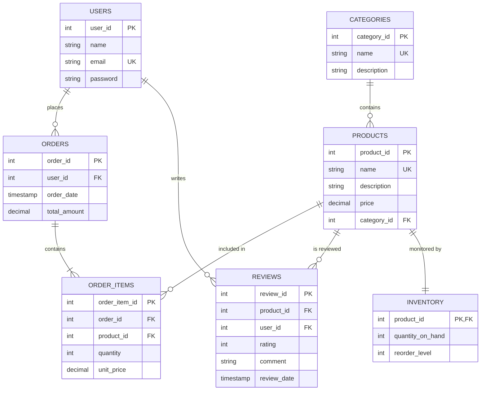

# Database Documentation - Smart E-Commerce System

This document provides a comprehensive overview of the database schema for the Smart E-Commerce System. The database is built on **PostgreSQL** and follows the **Third Normal Form (3NF)** to ensure data integrity and prevent redundancy.

## ER Diagram

---

## Data Dictionary

### 1. `Categories`
Stores product categories for classification.
- **category_id** (Serial, PK): Unique identifier.
- **name** (Varchar, UK, Not Null): Category name (e.g., Electronics, Fashion).
- **description** (Text): Optional category details.

### 2. `Users`
Stores authentication and profile data for customers and administrators.
- **user_id** (Serial, PK): Unique identifier.
- **name** (Varchar, Not Null): Full name of the user.
- **email** (Varchar, UK, Not Null): Login email.
- **password** (Varchar, Not Null): Hashed user password.

### 3. `Products`
Core table for available e-commerce items.
- **product_id** (Serial, PK): Unique identifier.
- **name** (Varchar, UK, Not Null): Display name.
- **description** (Text): Product specifications.
- **price** (Decimal, Not Null): Unit price; must be `>= 0`.
- **category_id** (Int, FK): References `Categories`. Prevent deletion if products exist (`RESTRICT`).

### 4. `Orders`
Records customer transactions.
- **order_id** (Serial, PK): Unique identifier.
- **user_id** (Int, FK): References `Users`.
- **order_date** (Timestamp): Defaults to `CURRENT_TIMESTAMP`.
- **total_amount** (Decimal): Sum of order items; must be `>= 0`.

### 5. `OrderItems`
Intersection table for many-to-many relationship between `Orders` and `Products`.
- **order_item_id** (Serial, PK): Unique identifier.
- **order_id** (Int, FK): References `Orders`. Deletes items if order is deleted (`CASCADE`).
- **product_id** (Int, FK): References `Products`.
- **quantity** (Int): Must be `> 0`.
- **unit_price** (Decimal): Price at the time of purchase.

### 6. `Reviews`
Customer feedback on products.
- **review_id** (Serial, PK): Unique identifier.
- **product_id** (Int, FK): References `Products`.
- **user_id** (Int, FK): References `Users`.
- **rating** (Int): Range `1-5`.
- **comment** (Text): Text review.
- **review_date** (Timestamp): When the review was submitted.

### 7. `Inventory`
Real-time tracking of product stock.
- **product_id** (Int, PK, FK): References `Products`.
- **quantity_on_hand** (Int): Current items in stock; must be `>= 0`.
- **reorder_level** (Int): Threshold for restocking alerts; defaults to `10`.

---

## Performance & Optimization

### Indexing Strategy
We have implemented targeted indexes to optimize search performance and join operations:
- **`idx_products_name`**: Fast lookup for product searches.
- **`idx_products_category`**: Optimizes filtering by category in the product browser.
- **`idx_orders_user`**: Speeds up user order history queries.

### Data Integrity
- **Foreign Keys**: Enforce referential integrity (e.g., you cannot delete a Category that has active Products).
- **CHECK Constraints**: Ensure business logic at the database level (e.g., `rating` between 1-5, `price >= 0`).
- **Unique Constraints**: Prevent duplicate entries for emails and product names.
